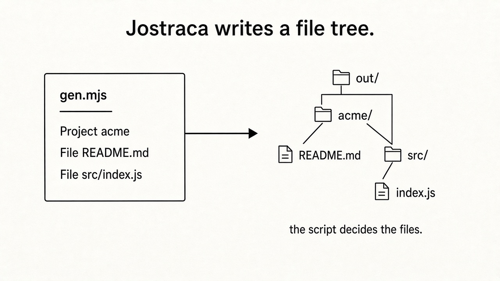
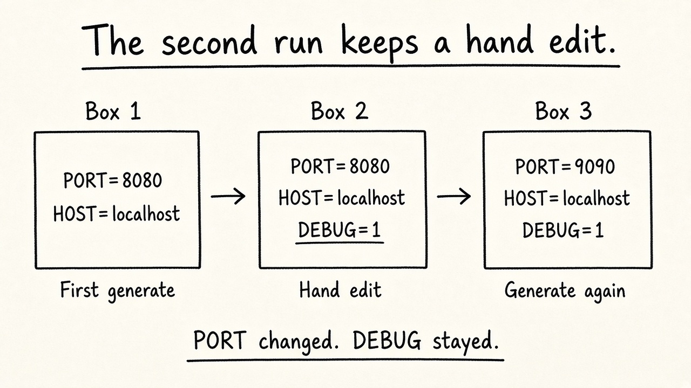
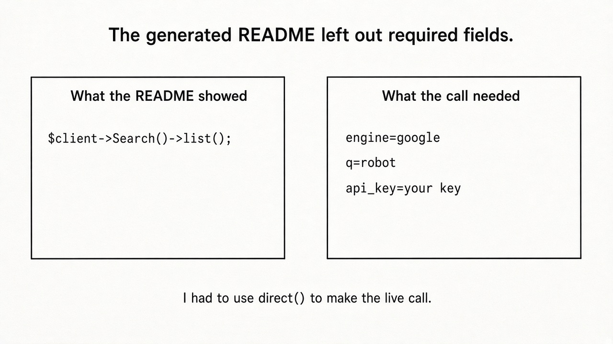

# A review of Jostraca after a run and a generated SDK

Jostraca is one of the open-source projects behind the Voxgig SDK generator. I found the name in a generate log while I was building a PHP client for the SearchAPI Google endpoint. I will focus on two things I can take into account: the example I ran locally from the Jostraca site and the README that the SDK generator wrote for this SearchAPI client.

Jostraca writes a tree of files from code. In the JavaScript version, a script names the folders, file names, and the text in each file. I saved the example of the site as `gen.mjs` and ran it with `node gen.mjs`.

```js
import { Jostraca, Project, Folder, File, Content } from 'jostraca'

await Jostraca().generate({ folder: './out' }, () => {
  Project({ folder: 'acme' }, () => {
    File({ name: 'README.md' }, () => {
      Content('# Acme\n')
    })
    Folder({ name: 'src' }, () => {
      File({ name: 'index.js' }, () => {
        Content('console.log("acme")\n')
      })
    })
  })
})
```

The script and the files on disk match.



This is a model for a developer who already writes JavaScript. A loop is a `for`. A condition is an `if`. There is a method on the site: beginning with an HTML file and changing simple tokens like APP_TITLE. The template is HTML, so an editor can show it clearly before creating the file. I only tried the JavaScript example. The site says a Go version is tested, so the same steps should create the files. I did not check that statement.

I then looked at what should happen when a user runs the system after editing a generated file. A generator that only runs in a directory is a starting point. SDK output is usually saved. People add notes and make small changes. Jostraca lists five options for a file that already exists: write, preserve, present, diff and merge. Write replaces the file. Merge is to keep a line that a person added.

The example described starts with this file:

```text
PORT=8080
HOST=localhost
```

A person adds DEBUG=1. The next generate changes the port and keeps that line:

```text
PORT=9090
HOST=localhost
DEBUG=1
```



I did not run this example. I am reporting it from the documentation. I am marking it as such. It is still relevant because a generated SDK is a tree that people edit. If I correct a comment, I need a way to generate again without losing that correction. The docs also say that a file with the text `JOSTRACA_PROTECT` is never overwritten. That rule is simple enough for a team to use.

These ten words are the vocabulary for this work: Project, Folder, File, Content, Line, Fragment, Slot, Inject, Copy and List. A custom piece is a function wrapped in `cmp()`. A short list is easier to learn than a template syntax that changes often.

The local example worked as explained. The problem I found in the SearchAPI SDK was in the text written, not in whether the files were created.

Running `npm run generate` for that SDK also went through Jostraca. It wrote a PHP client, a Search entity, tests, and a README. It completed the command. It gave warnings that `ReadmeFeatures_php` and `AgentGuide_php` were missing, and it reported success.

The generated README presented this as the call:

```php
$client = new SearchapiGoogleSDK();
$searchs = $client->Search()->list();
```

The OpenAPI description of that endpoint requires `engine` and `api_key`. A search a developer would run also needs `q`. Those names are not in the example. I tried a query for "robot". Pasting the README example was not enough. I used `direct()` and provided the query:

```php
$result = $client->direct([
    "path" => "/search",
    "method" => "GET",
    "query" => [
        "engine" => "google",
        "q" => "robot",
        "api_key" => "YOUR_KEY",
    ],
]);
```

The call returned a SearchAPI response. The `list()` example in the README did not contain the fields that the call needs.



Jostraca created the files named in `gen.mjs`. It also created the SDK files. The first code sample in the SearchAPI README did not have arguments. A later merge can keep a line someone types after completion. It does not fix a tutorial that shipped without those arguments. The missing-component warnings are easy to miss because generation ends successfully. A new developer with no experience with the SDK will copy `$client->Search()->list()` and look for the mistake in their own setup.

I would ask for two changes.

The first example should be built from the required parameters. For this endpoint, that means `engine`, `q`, and a placeholder for `api_key`. `direct()` should be available for endpoints that the entity methods do not cover, after an example that can succeed.

The warnings should state the consequences. If `ReadmeFeatures_php` and `AgentGuide_php` are optional, then the message should say that the SDK can still be used. If the README is missing parts, the generation should not succeed. A command that works, beside a tutorial that leaves out the fields, can lead a developer in the wrong direction.

This is a review. I ran a script. I created one PHP SDK for a single GET endpoint. I did not look at the Jostraca source code. I did not use merge mode on my files. That restricted path is still the path an SDK user follows: generate, open the README and try the sample.

I would use Jostraca when a project needs the same folders and file names every time, and when later changes to those files are expected. I'd run the sample before treating the generated README as ready for another developer. In the acme run, the files matched the script. In the SearchAPI README, the first example left out `engine`, `q`, and `api_key`.
